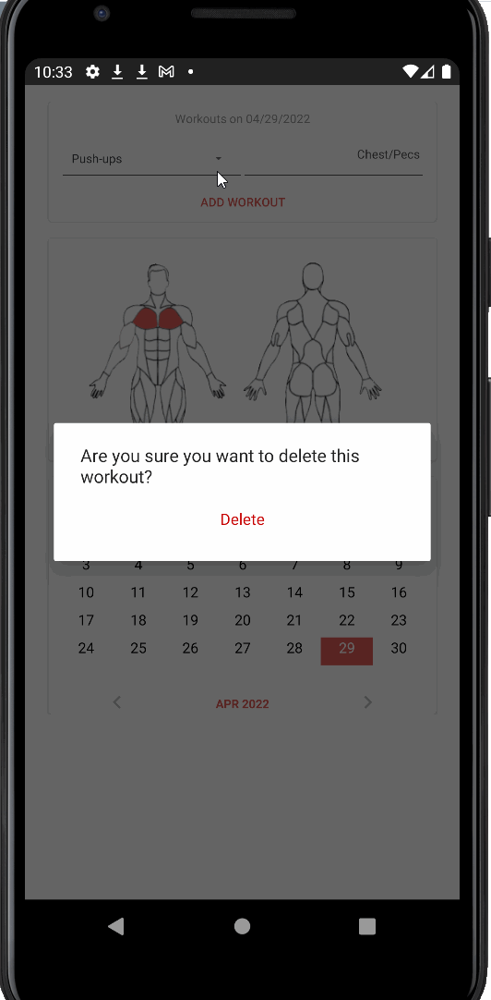

# EquaFit

**EquaFit** is an android app that allows tracking workouts. Features include adding new workouts with specific muscle groups, a dashboard which displays workouts
with a graphic, a calendar for recording and viewing workouts over time. 

## User Stories

The following is included:

* [x] User can **specify muscle groups worked per day**
* [x] User can **successfully add and remove items** from the workout list
* [x] User's **list of items persisted** workouts are saved permanently for viewing later
* [x] User can **a graphic that updates automatically** based on user selected workouts a graphic updates on the dashboard and also per unique day.

## Video Walkthrough

Here's a walkthrough of implemented user stories:

GIF created with [LiceCap](http://www.cockos.com/licecap/).
